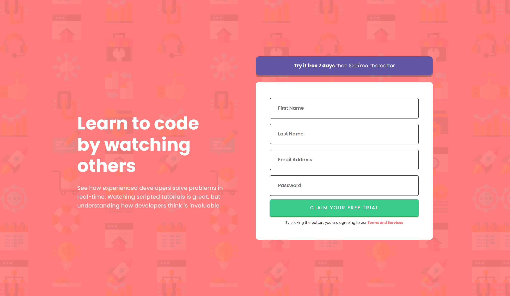

# Frontend Mentor - Intro component with sign up form solution

This is a solution to the [Intro component with sign up form challenge on Frontend Mentor](https://www.frontendmentor.io/challenges/intro-component-with-signup-form-5cf91bd49edda32581d28fd1). Frontend Mentor challenges help you improve your coding skills by building realistic projects. 

## Overview

### Screenshot

## Desktop

## Mobile

### Links

- Solution URL: [Github](https://github.com/Affan840/Intro-Component-with-SignUp-Form)
- Live Site URL: [Live Preview](https://affan840.github.io/Intro-Component-with-SignUp-Form/)

### Built with

- Semantic HTML5 markup
- CSS custom properties
- Flexbox

## Author

- Instagram - [@muhammad__affan07](https://www.instagram.com/muhammad__affan07/)